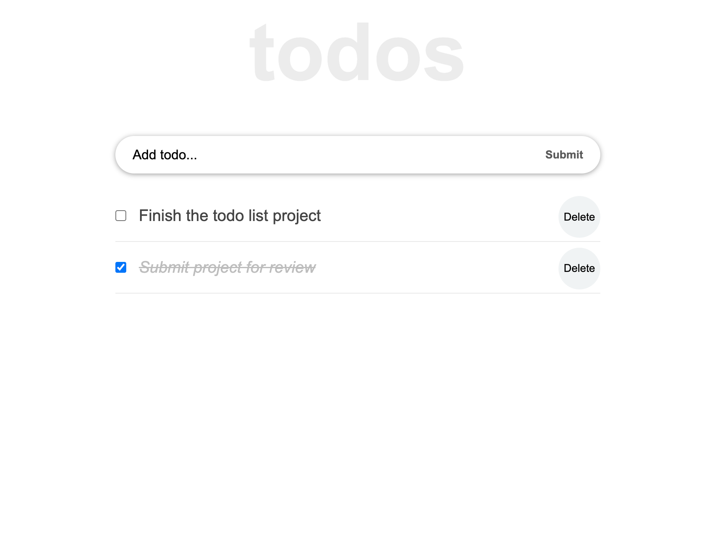

# To Do List React Version
This is a todo-list project built with React. You can Add, delete and edit your todos.

# Built with
- React.js
- HTML
- CSS

# Getting Started with Create React App
This project was bootstrapped with [Create React App](https://github.com/facebook/create-react-app).

## installation
In order to run on your local machine, type in;

- `npx create-react-app my-app`
- `cd my-app`
- `npm start`

### For the link to the live demo, [Click here](https://ilynette.github.io/todo_list_react/)

### For the link to the live demo, [Netlify](https://to-do-list-react-129.netlify.app/)

# Author
:bust_in_silhouette: **Author 1: Acholah Lynette**
- GitHub: [@iLynette](https://github.com/iLynette)
- Twitter: [@acholah_lynette](https://twitter.com/acholah_lynette)
- LinkedIn: [acholah lynette](https://www.linkedin.com/in/lynette-acholah/)

## :handshake: Contributing
Contributions, issues, and feature requests are welcome!
## Show your support
Give a :star:️ if you like this project!
## Acknowledgments

Todo_list React App
Web site created using create-react-app